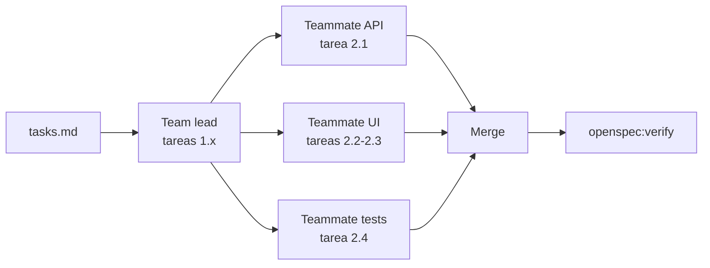

<Eyebrow>M5 · Arquitectura</Eyebrow>

## De tasks.md al merge

```mermaid
flowchart LR
  T[tasks.md] --> L[Team lead<br/>tareas 1.x]
  L --> A[Teammate API<br/>tarea 2.1]
  L --> B[Teammate UI<br/>tareas 2.2-2.3]
  L --> C[Teammate tests<br/>tarea 2.4]
  A --> M[Merge]
  B --> M
  C --> M
  M --> V[openspec:verify]
```

<Callout>Lo secuencial lo hace el lead **antes** de lanzar al team.</Callout>
